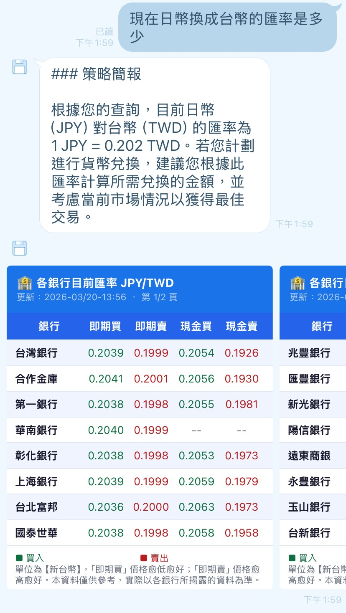

# Welcome
This project conducts a Line Chatbot to solve users' financial questions.

## Chatbot Abilities

### Currency
1. Real-time currency exchange rate
2. Bank rate comparasion

### Stock
--- Preparing ---

### Present



## Activate the chatbot
1. Terminal 1 — Flask app:
```bash
python app.py
```
2. Terminal 2 — ngrok:
```bash
ngrok http 5001
```
3. Check the server is running by **https://prisonlike-sarky-floyd.ngrok-free.dev/health**


# References

## Pre-preparasion for connecting to Line Chatbot
- [How to get LINE Channel Access Token.](https://daily146.com/line-channel-access-token)
- [Python-to-Line Chatbot guidance 1](https://ithelp.ithome.com.tw/articles/10337794)
- [Python-to-Line Chatbot guidance 2](https://ithelp.ithome.com.tw/articles/10338062)

## Codings reference
- [pyhton-to-linebot](https://pypi.org/project/line-bot-sdk/)

## Websites / Services
- [ngrok](https://ngrok.com)
    - Free HTTPS tunnel for local development
- [Line Official Account Manager](https://manager.line.biz/account/@156qcdrh/setting/response)
    - Manage bot responses & settings
- [Line Developer](https://developers.line.biz/console/)
    - Webhook & API key settings
- Other resources
    - [理財鴿：銀行即時匯率](https://www.fintechgo.com.tw/FinInfo/ForexRate/BankRealExRate/Currency/USD)