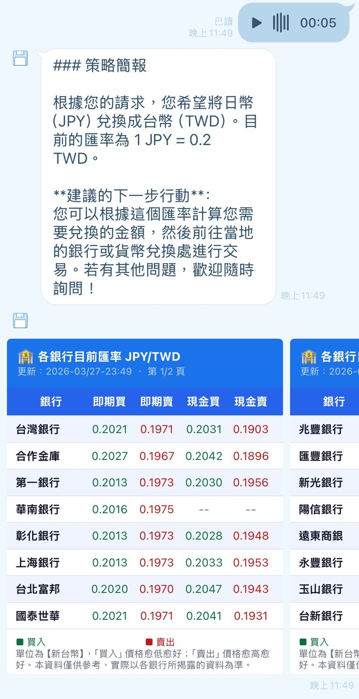

# Welcome
This project conducts a Line Chatbot to solve users' financial questions.

## Chatbot Abilities

### Message Type
1. Text Message
2. Audio Message

### Currency
1. Real-time currency exchange rate
2. Bank rate comparasion

### Stock
--- Preparing ---

### Present




## Deployment

### Deploy the chatbot in local(ngrok)
1. Terminal 1 — Flask app:
```bash
python app.py
```
2.Terminal 2 — ngrok:
```bash
ngrok http 5001
```
3. Check the server is running on **https://prisonlike-sarky-floyd.ngrok-free.dev/health**
4. Setup Webhook URL setting in Line Developers
`https://prisonlike-sarky-floyd.ngrok-free.dev/callback`

### Deploy the chatbot on cloud(render)
- Different branches have responding Webhook URL
- Set `region` in Render as `Singapore (Southeast Asia)`

# References

## Pre-preparasion for connecting to Line Chatbot
- [How to get LINE Channel Access Token.](https://daily146.com/line-channel-access-token)
- [Python-to-Line Chatbot guidance 1](https://ithelp.ithome.com.tw/articles/10337794)
- [Python-to-Line Chatbot guidance 2](https://ithelp.ithome.com.tw/articles/10338062)

## Codings reference
- [pyhton-to-linebot](https://pypi.org/project/line-bot-sdk/)

## Websites / Services
- [Line Official Account Manager](https://manager.line.biz/account/@156qcdrh/setting/response)
    - Manage bot responses & settings
- [Line Developer](https://developers.line.biz/console/)
    - Webhook & API key settings
- [ngrok](https://ngrok.com)
    - Free HTTPS tunnel for **local deployment**
- [Render](https://dashboard.render.com)
    - For **cloud deployment**
    - ⭐️ Need to write **`.python-versioin`** to delpoy with setting python version
- [Gunicorn (Green Unicorn)](https://gunicorn.org)
- Other resources
    - [理財鴿：銀行即時匯率](https://www.fintechgo.com.tw/FinInfo/ForexRate/BankRealExRate/Currency/USD)
        - Deploy in **local** is available, but when in **render** is unavailable. → `IP Address Issue` 
